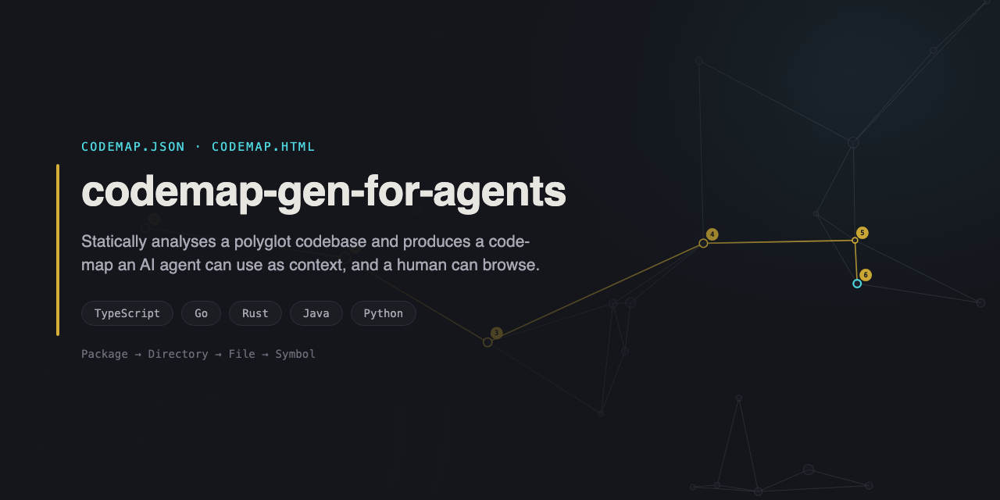
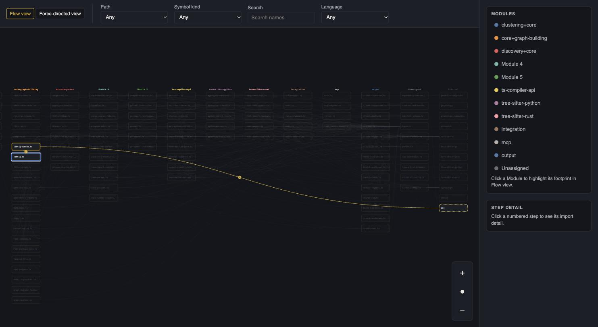
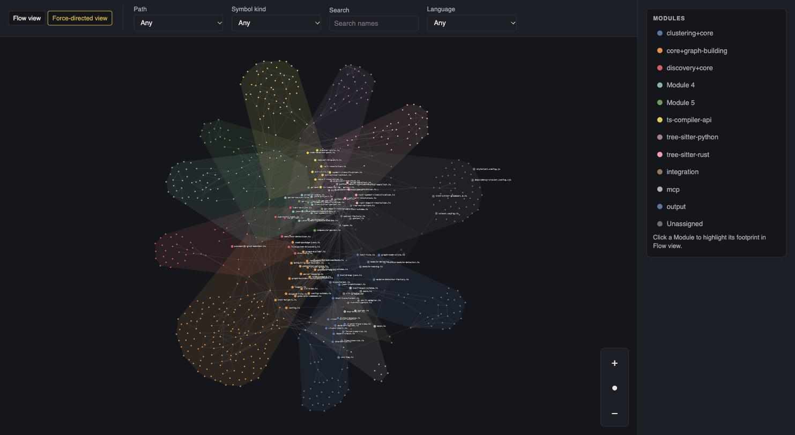

# codemap-gen-for-agents

[Back to 02-language-convention.md](CODING_RULES/02-language-convention.md) • [Back to 10-commits-and-versioning.md](CODING_RULES/10-commits-and-versioning.md) • [Back to GIT.md](documentation/GIT.md) • [Back to TESTING.md](documentation/TESTING.md) • [Back to USER_GUIDE.md](documentation/USER_GUIDE.md) • [Back to SECURITY.md](SECURITY.md)



[](https://www.npmjs.com/package/@windagency/codemap-gen-for-agents)
[](https://github.com/windagency/codemap-gen-for-agents/actions/workflows/ci.yml)
[](LICENSE)

**Give your AI coding agent a map of the codebase instead of making it grep its way around.**

Point it at a repo - TypeScript/JavaScript, Go, Rust, Java, Python, any mix in one place - and it statically analyses the whole thing into one graph, then hands you two views of it:

|                       |                                                                               |
| --------------------- | ----------------------------------------------------------------------------- |
| 🤖 **`codemap.json`** | Machine-readable. Context for Claude Code, Claude Desktop, or any MCP client. |
| 🧑‍💻 **`codemap.html`** | One offline file. Open it in a browser and click around.                      |

No LLM call, no manual annotation, zero-config to get a first result. The graph - **Package → Directory → File → Symbol**, plus a cross-cutting **Module** grouping detected algorithmically from the real import graph, with no config knob to override it - comes entirely from your code's actual imports and calls. Full glossary of these terms: [`CONTEXT.md`](CONTEXT.md). An optional `codemap.config.json` tunes `outDir`/`exclude` if you need it: [`documentation/USER_GUIDE.md`](documentation/USER_GUIDE.md#config-file).

## See it in action

`codemap.html` is self-contained - no server, no network calls, works fully offline. Two views over the same graph (generated here from this repo's own source):

**Flow view** - click a file to walk its import chain breadth-first; edges are numbered in traversal order.



**Force-directed view** - the whole graph laid out spatially, with detected Modules visually grouped into regions.



A filter bar narrows either view by path, symbol kind, language, or free text - see [Reading the HTML visualisation](documentation/USER_GUIDE.md#reading-the-html-visualisation) for the full walkthrough.

> **Status:** 1.0, published to npm (see the badge above for the current version). TS/JS resolution is type-checked; Go/Rust/Java/Python resolution is syntactic (tree-sitter) - a deliberate, documented fidelity split, not a gap ([ADR-0027](documentation/adr/0027-tree-sitter-multi-language-extraction.md)). Open work, including full type-checked resolution for those four, is tracked in [`NEXT_STEPS.md`](NEXT_STEPS.md).

---

## For users

### 1. Install

```bash
npm install -g @windagency/codemap-gen-for-agents    # or: pnpm add -g / yarn global add / bun add -g
```

This puts `codemap` and `codemap-mcp` on your `PATH`. Yarn Berry (v2+) has no global-install command at all - use `yarn dlx` below instead, every time.

**Linux on arm64:** `tree-sitter-java` 0.23.5 ships an x86-64 binary as its `linux-arm64` prebuild, so the Java grammar has to compile from source during install. Have Python 3, `make` and a C++ compiler installed first (Debian/Ubuntu: `apt install python3 make g++`). npm 12 also skips install scripts for global installs, so allow that one build explicitly: `npm install -g --allow-scripts=tree-sitter-java @windagency/codemap-gen-for-agents`. Without it, `codemap generate` fails on every repository, Java or not. Every other platform's prebuild matches its architecture, so nothing extra is needed elsewhere, and npm 11 runs the build without the flag.

**Or run it without installing.** This package ships two bins (`codemap`, `codemap-mcp`), neither named after the package itself, so every runner needs an explicit `--package`/`-p` flag to say which one to run:

| Runner            | Command                                                                              |
| ----------------- | ------------------------------------------------------------------------------------ |
| npm (`npx`)       | `npx -p @windagency/codemap-gen-for-agents codemap generate --root . --out .codemap`             |
| pnpm              | `pnpm dlx --package=@windagency/codemap-gen-for-agents codemap generate --root . --out .codemap` |
| Yarn (Berry, v2+) | `yarn dlx -p @windagency/codemap-gen-for-agents codemap generate --root . --out .codemap`        |
| Bun               | `bunx -p @windagency/codemap-gen-for-agents codemap generate --root . --out .codemap`            |

Yarn Classic (v1, what `npm install -g yarn` gives you by default) has no `dlx` command at all - only Yarn Berry (`yarn set version berry`, or via Corepack) supports this.

`codemap-mcp` is a different shape: a stdio **MCP server**, not a one-shot command - it takes no CLI arguments at all, and you don't run it by hand to get output. Instead, **register it** in your MCP client's config and let the client launch it:

```json
{
  "mcpServers": {
    "codemap": {
      "command": "codemap-mcp"
    }
  }
}
```

Or, without a global install, point `command`/`args` at the `npx`/`dlx`/`bunx` form instead, e.g. `"command": "npx", "args": ["-p", "@windagency/codemap-gen-for-agents", "codemap-mcp"]`.

In Claude Code specifically, `claude mcp add` does the same thing from the terminal - note that `--scope`/other options go _before_ the `--` separator, not after it:

```bash
claude mcp add codemap --scope project -- codemap-mcp
# or, without a global install:
claude mcp add codemap --scope project -- npx -p @windagency/codemap-gen-for-agents codemap-mcp
```

Once registered, the client calls its two tools - `generate` and `read` - passing `rootDir`/`outDir`/etc. as the tool's input, not as flags. Exact tool schemas: [`documentation/USER_GUIDE.md#mcp-server`](documentation/USER_GUIDE.md#mcp-server).

Already inside a Claude Code session? Run the same command with a `!` prefix, then check `/mcp`. Adding or removing the Skill, disabling either one, and example prompts: [Managing codemap from a running Claude Code session](documentation/USER_GUIDE.md#managing-codemap-from-a-running-claude-code-session).

### 2. Generate

```bash
codemap generate --root /path/to/your/repo --out .codemap
```

```json
{ "jsonPath": ".codemap/codemap.json", "htmlPath": ".codemap/codemap.html", "nodeCount": 8, "edgeCount": 4 }
```

### 3. Explore

Open `.codemap/codemap.html` in any browser. Hand `.codemap/codemap.json` to your agent as context.

### 4. Configure (optional)

Configuration is **per-repo, not global** - `npm install -g` only puts the binaries on your `PATH`; it writes nothing to a global config directory. To tune anything, add `codemap.config.json` **at the directory you pass to `--root`**:

```json
{ "outDir": ".codemap", "exclude": ["**/generated/**"] }
```

The lookup is flat, not a walk up parent directories - a config file one level above `--root` is never picked up. Pass `--config <path>` if you want to keep it somewhere else. Full field reference: [`documentation/USER_GUIDE.md#config-file`](documentation/USER_GUIDE.md#config-file).

### Three ways to run it

| Surface           | Entry point                                                        | Use case                                                                                               |
| ----------------- | ------------------------------------------------------------------ | ------------------------------------------------------------------------------------------------------ |
| CLI               | `codemap generate`                                                 | One-shot generation from a terminal or script                                                          |
| MCP server        | `codemap-mcp`                                                      | `generate`/`read` tools for any MCP client (Claude Code, Claude Desktop, ...)                          |
| Claude Code Skill | [`src/integration/skill/SKILL.md`](src/integration/skill/SKILL.md) | An agent calls the companion script directly, no CLI/MCP round-trip. Install `dist/integration/skill/` |

Building from source instead of installing from npm, every flag, the config file, the full `codemap.json` schema, and known limitations: **[`documentation/USER_GUIDE.md`](documentation/USER_GUIDE.md)**.

---

## For maintainers

### How it works


Four stages (Discovery → Parser → GraphBuilder → ModuleDetector) behind three peer integration adapters (CLI, MCP, Skill), wired once at a single composition root (`core/compose.ts`). Design goals and the "why" behind each seam: **[`documentation/HLD.md`](documentation/HLD.md)**. Per-component interfaces and types: **[`documentation/LLD.md`](documentation/LLD.md)**.

### Documentation map

| Doc                                                             | Audience          | Covers                                                                                               |
| --------------------------------------------------------------- | ----------------- | ---------------------------------------------------------------------------------------------------- |
| [`documentation/USER_GUIDE.md`](documentation/USER_GUIDE.md)    | User              | Install, CLI/MCP/Skill usage, config, output shape, known limitations                                |
| [`documentation/HLD.md`](documentation/HLD.md)                  | Maintainer        | Pipeline architecture, seams, adapters, design rationale                                             |
| [`documentation/LLD.md`](documentation/LLD.md)                  | Maintainer        | Per-component interfaces, types, and implementation detail                                           |
| [`documentation/FLOWS.md`](documentation/FLOWS.md)              | Both              | Step-by-step runtime flows (generate, incremental re-run, MCP read, HTML interaction)                |
| [`documentation/adr/`](documentation/adr)                       | Maintainer        | Why each architectural decision was made, in order                                                   |
| [`documentation/DEPLOYMENT.md`](documentation/DEPLOYMENT.md)    | Maintainer        | Commit-driven release pipeline: CI, commitlint, semantic-release, npm publish, signing               |
| [`documentation/GIT.md`](documentation/GIT.md)                  | Contributor       | Git hook behaviour, commit signing setup, branch model                                               |
| [`documentation/GITFLOW.md`](documentation/GITFLOW.md)          | Contributor       | Visual branch flow: `feat-`/`fix-` → `int` → `main`, `hotfix-` → `main` + `int`, `release/*.x` lines |
| [`documentation/SEMVER.md`](documentation/SEMVER.md)            | Contributor       | SemVer policy, `CHANGELOG.md` mechanics                                                              |
| [`documentation/TESTING.md`](documentation/TESTING.md)          | Contributor       | QA checklist, CI command set, test seams for an agent to extend                                      |
| [`CONTEXT.md`](CONTEXT.md)                                      | Both              | Domain glossary (Cluster, Module, Interaction, Filter, ...)                                          |
| [`AGENTS.md`](AGENTS.md) / [`CONTRIBUTING.md`](CONTRIBUTING.md) | Contributor       | How to work in this repo, coding rules, definition of done                                           |
| [`MAINTAINERS.md`](MAINTAINERS.md)                              | Contributor       | Who maintains this project and response-time expectations                                            |
| [`GOVERNANCE.md`](GOVERNANCE.md)                                | Contributor       | Decision-making process, when an ADR is required, path to co-maintainer                              |
| [`SECURITY.md`](SECURITY.md)                                    | User, Contributor | Supported versions, how to report a vulnerability                                                    |
| [`CODE_OF_CONDUCT.md`](CODE_OF_CONDUCT.md)                      | Both              | Community standards and enforcement                                                                  |
| [`CHANGELOG.md`](CHANGELOG.md)                                  | Both              | Release history, generated by semantic-release from commit history                                   |
| [`THIRD_PARTY_LICENSES.md`](THIRD_PARTY_LICENSES.md)            | User              | Licences of every production dependency this package ships with                                      |

### Local dev loop

```bash
pnpm install
pnpm test          # Vitest; pnpm test:watch for watch mode
pnpm lint
pnpm typecheck
pnpm build
```

The full CI command set (includes `lint:css`/`licenses:check`/`backlinks:check`) and the QA checklist: [`documentation/TESTING.md`](documentation/TESTING.md). Git workflow and commit signing: [`documentation/GIT.md`](documentation/GIT.md) / [`documentation/GITFLOW.md`](documentation/GITFLOW.md).

**Before making changes**, read [`AGENTS.md`](AGENTS.md) and [`CONTRIBUTING.md`](CONTRIBUTING.md) - coding rules, definition of done, and how this repo expects agents and humans to work.

---

Licence: [MIT](LICENSE) • Security issues: [`SECURITY.md`](SECURITY.md) • Community standards: [`CODE_OF_CONDUCT.md`](CODE_OF_CONDUCT.md)
